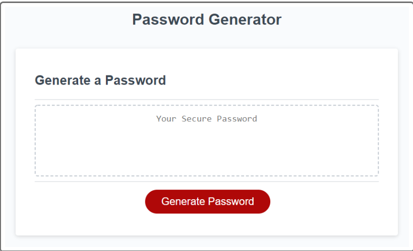

# Password-Generator

## Description
Develop a browser based tool for users to generate a customized password using pre selected criteria

## User-Story
AS AN employee with access to sensitive data
I WANT to randomly generate a password that meets certain criteria
SO THAT I can create a strong password that provides greater security

## Acceptance-Criteria
GIVEN I need a new, secure password
WHEN I click the button to generate a password
THEN I am presented with a series of prompts for password criteria
WHEN prompted for password criteria
THEN I select which criteria to include in the password
WHEN prompted for the length of the password
THEN I choose a length of at least 8 characters and no more than 128 characters
WHEN asked for character types to include in the password
THEN I confirm whether or not to include lowercase, uppercase, numeric, and/or special characters
WHEN I answer each prompt
THEN my input should be validated and at least one character type should be selected
WHEN all prompts are answered
THEN a password is generated that matches the selected criteria
WHEN the password is generated
THEN the password is either displayed in an alert or written to the page

## Mock-Up
Please view live URL: [Password-Generator](https://rxn3202.github.io/Password-Generator)

- When user clokcs on the "Generate Password" button, they will be prompted with a series of questions, including:
    - The desired size of the password (between 8 to 128 characters)
    - Do they want lowercase letters
    - Do they want uppercase letters
    - Do they want numeric characters
    - Do they want special characters
- User's input will be validated to ensure that size is within the allowed range and at least one character set has been selected.
- After validation, a random password will be generated based on the provided criteria in the text box displayed on the web page. 

